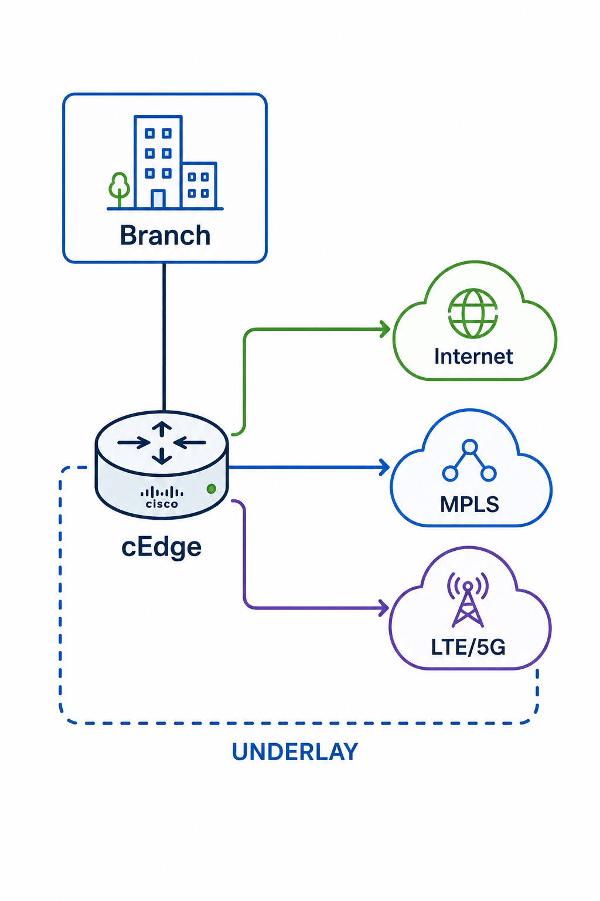
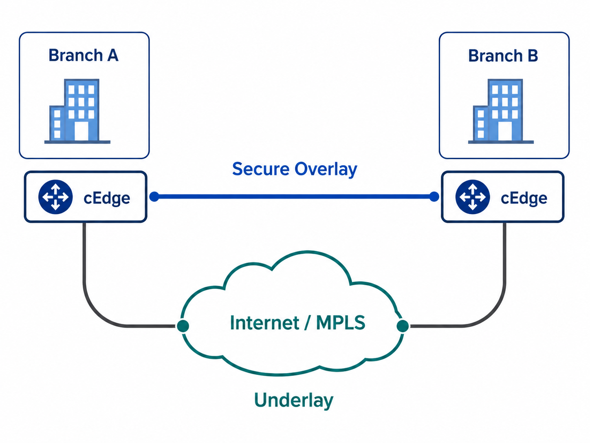
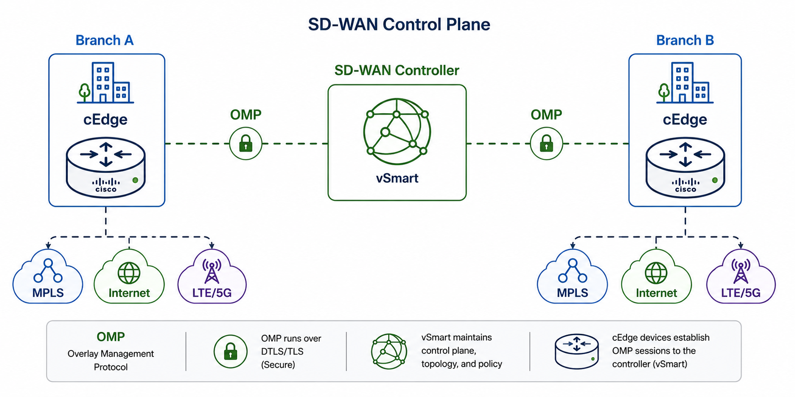
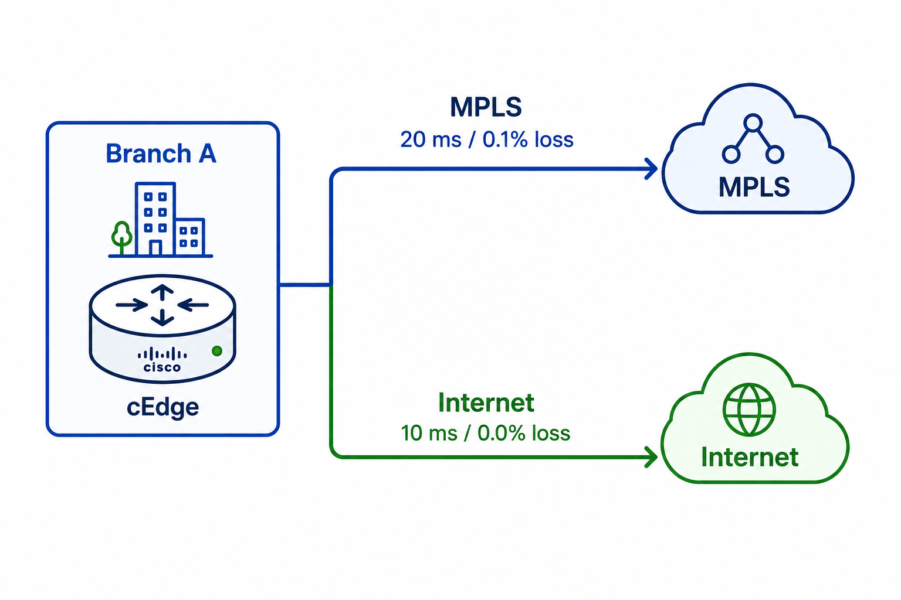

# Software-Defined Wide Area Network (SD-WAN)

> **SD-WAN** is a software-defined WAN architecture that centrally manages and securely connects geographically separated branches, campuses, data centers, and cloud environments across multiple WAN transport technologies.

---

## Overview

Traditional WANs often require administrators to configure routing, security, and traffic-engineering policies individually on each WAN router.

**SD-WAN simplifies WAN operations by providing centralized management and policy control.**

It allows organizations to use multiple WAN transports simultaneously, including:

* MPLS
* Broadband Internet
* Dedicated Internet Access (DIA)
* Metro Ethernet
* LTE / 5G
* Cloud connectivity

Instead of relying only on the routing table to determine the best path, SD-WAN can make forwarding decisions based on:

* Application
* Link availability
* Latency
* Jitter
* Packet loss
* Bandwidth
* Business policy
* SLA requirements

---

# Traditional WAN vs SD-WAN

<div align="center">

| Feature | Traditional WAN | SD-WAN |
| :--- | :--- | :--- |
| **Management** | Device-by-device | Centralized |
| **Configuration** | Mostly manual | Policy-driven and automated |
| **WAN Transport** | Often MPLS-centric | MPLS, Internet, LTE/5G, cloud, etc. |
| **Path Selection** | Primarily routing metrics | Application and SLA-aware |
| **Failover** | Routing protocol convergence | Dynamic path steering |
| **Visibility** | Distributed | Centralized monitoring and analytics |
| **Deployment** | CLI-heavy | Controller/template-driven |
| **Security** | Added separately depending on design | Integrated secure overlay |
| **Scalability** | Increasing operational complexity | Designed for large distributed WANs |

</div>


---

# VPN vs SD-WAN

A **VPN** and **SD-WAN** are related, but they solve different problems.

### VPN

A traditional site-to-site VPN primarily provides **secure connectivity between networks over an untrusted transport such as the Internet**.

Its main purpose is to provide:

* Confidentiality
* Integrity
* Authentication
* Secure site-to-site communication

### SD-WAN

SD-WAN provides an entire **WAN architecture and control system**.

It can provide:

* Centralized management
* Centralized policy
* Secure overlay tunnels
* Dynamic path selection
* Application-aware routing
* SLA-based forwarding
* Multi-transport support
* Network segmentation
* Automated deployment
* Centralized monitoring

### Simple Comparison

<div align="center">

| VPN | SD-WAN |
| :--- | :--- |
| Secure tunnel technology | Complete WAN architecture |
| Primarily provides secure connectivity | Provides connectivity, control, automation, and optimization |
| Usually configured tunnel-by-tunnel | Centrally managed |
| Limited path intelligence by itself | Dynamic and application-aware path selection |
| Can operate independently | Commonly uses secure VPN technologies such as IPsec |

</div>

> **Remember:**
> **VPN = Secure tunnel**
> **SD-WAN = Centrally managed WAN architecture that can use secure VPN tunnels to build its overlay**

---

# Cisco Catalyst SD-WAN Architecture

Cisco Catalyst SD-WAN separates the solution into several logical planes:

<div align="center">
  
</div>

---

## 1. Catalyst SD-WAN Manager

> Formerly known as **vManage**

**Plane:** Management Plane

The SD-WAN Manager provides centralized configuration, monitoring, and administration of the SD-WAN fabric.

### Responsibilities

* Centralized GUI
* Device configuration
* Configuration templates
* Policy configuration
* Monitoring
* Troubleshooting
* Software management
* Statistics and telemetry
* Network visibility

### Remember

```text
Manager = Management
```

---

## 2. Catalyst SD-WAN Controller

> Formerly known as **vSmart**

**Plane:** Control Plane

The SD-WAN Controller provides centralized control-plane intelligence for the SD-WAN fabric.

It exchanges routing and policy information with WAN Edge routers primarily through the **Overlay Management Protocol (OMP)**.

### Responsibilities

* Learns routes from WAN Edge routers
* Distributes routing information
* Distributes TLOC information
* Distributes security information
* Applies centralized control policies
* Influences how traffic should traverse the SD-WAN fabric

### Remember

```text
Controller = Control
vSmart = OMP + Routing + Policy
```

---

## 3. Catalyst SD-WAN Validator

> Formerly known as **vBond**

**Plane:** Orchestration Plane

The SD-WAN Validator assists devices during their initial connection to the SD-WAN fabric.

### Responsibilities

* Authenticates SD-WAN devices
* Helps authorize devices into the fabric
* Assists with initial orchestration
* Provides information required to locate SD-WAN Controllers and Managers
* Helps devices establish the required control connections

### Remember

```text
Validator = Authentication + Orchestration
```

---

## 4. WAN Edge Router

**Plane:** Data Plane

WAN Edge routers are the devices that actually **forward user traffic between sites**.

Cisco IOS XE SD-WAN routers are commonly referred to as **cEdge** devices.

### Responsibilities

* Forward user traffic
* Build secure overlay tunnels
* Connect LAN/service networks to WAN transports
* Enforce centralized policies
* Perform application-aware routing
* Monitor tunnel/path health
* Participate in OMP
* Provide segmentation
* Perform QoS and traffic steering

### Remember

```text
WAN Edge = Data Forwarding
```

---

# Cisco SD-WAN Components Summary

<div align="center">

| Component             | Legacy Name   | Plane         | Main Function                               |
| --------------------- | ------------- | ------------- | ------------------------------------------- |
| **SD-WAN Manager**    | vManage       | Management    | Configuration and monitoring                |
| **SD-WAN Controller** | vSmart        | Control       | Routing information and policy distribution |
| **SD-WAN Validator**  | vBond         | Orchestration | Authentication and initial connectivity     |
| **WAN Edge**          | cEdge / vEdge | Data          | User traffic forwarding                     |

</div>

### Memory Trick

```text
Manager    → Manage
Controller → Control
Validator  → Validate
WAN Edge   → Forward
```

---

# Underlay vs Overlay

Understanding the difference between the **underlay** and **overlay** is fundamental to SD-WAN.

---

## Underlay

The **underlay** is the IP transport network that provides basic connectivity between SD-WAN devices.

Examples include:

* MPLS
* Broadband Internet
* DIA
* Metro Ethernet
* LTE
* 5G
* Cloud connectivity

The underlay only needs to provide sufficient **IP reachability** between the SD-WAN components.

<div align="center">
  
</div>

### Think of the Underlay As

> The roads that physically allow locations to reach each other.

---

## Overlay

The **overlay** is the logical SD-WAN fabric built **on top of the underlay transports**.

WAN Edge routers establish tunnels across the available underlay networks.


<div align="center">
  
</div>

The overlay provides capabilities such as:

* Secure tunnels
* Logical SD-WAN fabric
* Segmentation
* Centralized policy enforcement
* Dynamic path selection
* Application-aware routing

Cisco Catalyst SD-WAN data-plane tunnels are commonly protected using **IPsec**.

### Think of the Overlay As

> The virtual road system SD-WAN builds and controls on top of the physical roads.

---

# Underlay vs Overlay Summary

<div align="center">

| Underlay                           | Overlay                                       |
| ---------------------------------- | --------------------------------------------- |
| Physical/IP transport connectivity | Logical SD-WAN fabric                         |
| Internet, MPLS, LTE/5G, etc.       | Tunnels between WAN Edge routers              |
| Provides basic IP reachability     | Provides SD-WAN services                      |
| Transport provider infrastructure  | Enterprise-controlled logical topology        |
| Carries the tunnels                | Carries enterprise traffic inside the tunnels |

</div>

---

# Important SD-WAN Protocols and Concepts

## OMP — Overlay Management Protocol

**OMP** is the primary control-plane protocol used between WAN Edge routers and SD-WAN Controllers.

It distributes information such as:

* Routes
* TLOCs
* Service information
* Policy-related information

Conceptually:

<div align="center">
  
</div>

> **OMP is similar in purpose to a routing/control-plane protocol for the SD-WAN overlay.**

---

## TLOC — Transport Locator

A **TLOC** identifies an SD-WAN transport attachment.

Examples of transport colors can represent connections such as:

```text
MPLS
Internet
Public Internet
LTE
Private WAN
```

TLOC information allows the SD-WAN fabric to understand **how an Edge router can be reached through its available WAN transports**.

---

## BFD — Bidirectional Forwarding Detection

Cisco SD-WAN uses **BFD** across data-plane tunnels to monitor path health.

BFD can measure characteristics such as:

* Reachability
* Latency
* Jitter
* Packet loss

SD-WAN can then use this information for **Application-Aware Routing**.

Example:

<div align="center">
  
</div>

If a policy says:

```text
Voice requires:
Latency < 150 ms
Loss    < 1%
Jitter  < 30 ms
```

SD-WAN can dynamically select a path that satisfies those requirements.

---

# Application-Aware Routing

One of the major advantages of SD-WAN is the ability to select paths based on **application requirements and real-time link conditions**.

Traditional routing might simply see:

```text
MPLS = Preferred Route
Internet = Backup Route
```

SD-WAN can instead evaluate:

```text
Application
    ↓
SLA Requirements
    ↓
Current Path Metrics
    ↓
Policy
    ↓
Best Available Transport
```

Example:

```text
VoIP          →  MPLS
Office 365    →  Direct Internet
YouTube       →  Broadband
Critical App  →  Lowest-loss path
```

This allows traffic to use the WAN based on **business intent**, not simply static routing metrics.

---

# How Cisco SD-WAN Works

A simplified SD-WAN workflow is:

```text
1. WAN Edge boots
2. Edge reaches the SD-WAN Validator
3. Device is authenticated and orchestrated
4. Edge establishes control connections
5. OMP exchanges routing and TLOC information
6. WAN Edge routers establish data-plane tunnels
7. BFD monitors tunnel/path quality
8. Policies determine how applications use each path
9. User traffic is forwarded directly between WAN Edge routers
```

---

# Traditional Routing vs SD-WAN Path Selection

### Traditional WAN

```text
Routing Protocol
      ↓
Route Metric
      ↓
Best Route
      ↓
Forward Traffic
```

### SD-WAN

```text
Application
     +
Business Policy
     +
Latency
     +
Jitter
     +
Packet Loss
     +
Transport Availability
     ↓
Best Path
     ↓
Forward Traffic
```

---

# Key Takeaways

> [!IMPORTANT]
> **SD-WAN does not replace the WAN.**
> It provides a software-defined architecture for **controlling and optimizing how the WAN is used**.

> [!NOTE]
> **Underlay = Transport network**
> Internet, MPLS, LTE/5G, Metro Ethernet, etc.

> [!NOTE]
> **Overlay = Logical SD-WAN fabric**
> Secure tunnels built across the underlay.

> [!TIP]
> **VPN and SD-WAN are not the same thing.**
> A VPN provides secure tunneling. SD-WAN provides centralized control, automation, traffic engineering, monitoring, segmentation, and secure overlay connectivity.

> [!TIP]
> For Cisco Catalyst SD-WAN, remember:
>
> ```text
> Manager    → Management
> Controller → Control / OMP / Policy
> Validator  → Authentication / Orchestration
> WAN Edge   → Data Forwarding
> ```

---

## Quick Reference

<div align="center">
  
</div>
