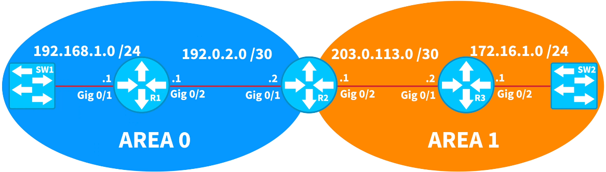

# OSPF Troubleshooting

## Issue 
None of the routers are learning OSPF routes. Examine and correct the existing OSPF configuration on each router such that each router has full visibility to all networks.

  

## Show commands to use
1. show ip route - Verify if there are any formed OSPF-learned routes.
2. show ip protocols - Verify if there are any OSPF configured in all routers and if the OSPF Process ID in all routers match.
3. show run | section ospf - Verify if all the remote network addresses are advertised.
4. show ospf neighbor - To verify if the routers formed OSPF neighborship.
5. show ip ospf interface <interface-id> - Verify if the hello timers match on the router interfaces.
6. show interface <interface-id> - Verify the the MTU size match on the router interfaces.
